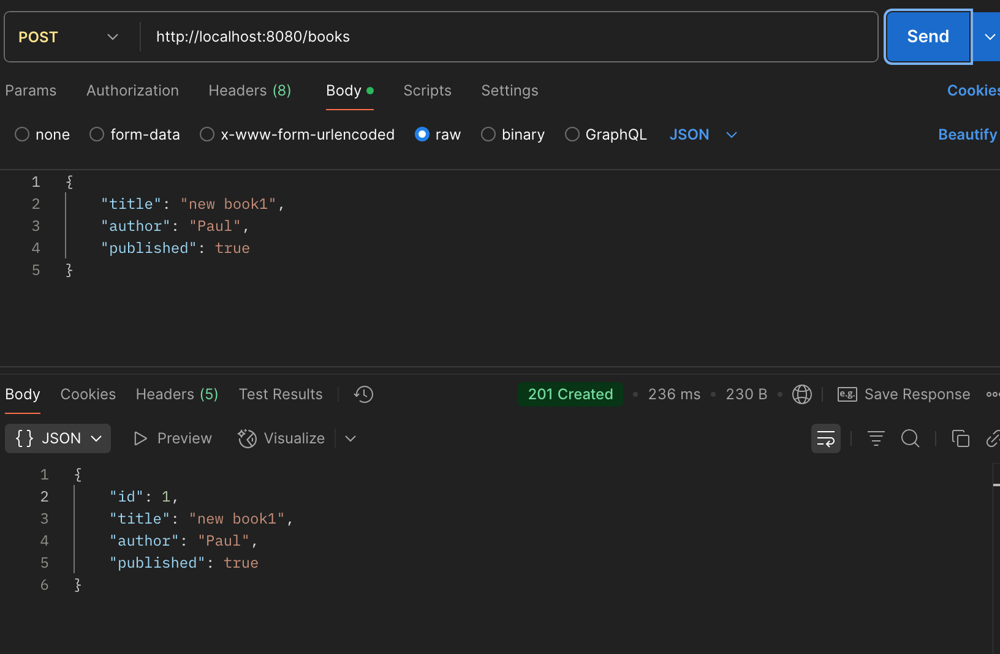

# Spring Boot REST API - Book Management

This project is a Spring Boot application that exposes a RESTful API for managing books. It allows users to perform CRUD operations on a Book resource, which includes properties such as id, title, author, and published status.

## Project Structure

```
spring_boot_CRD
├── src
│   ├── main
│   │   ├── java
│   │   │   └── com
│   │   │       └── example
│   │   │           └── bookapi
│   │   │               ├── BookApiApplication.java
│   │   │               ├── controller
│   │   │               │   └── BookController.java
│   │   │               ├── model
│   │   │               │   └── Book.java
│   │   │               ├── repository
│   │   │               │   └── BookRepository.java
│   │   │               └── service
│   │   │                   └── BookService.java
│   │   └── resources
│   │       ├── application.properties
│   │       └── data.sql
│   └── test
│       └── java
│           └── com
│               └── example
│                   └── bookapi
│                       └── BookApiApplicationTests.java
├── pom.xml
└── README.md
```

## Features

- **Create a Book**: Add a new book with validated title and author properties.
- **Retrieve Books**: Get a list of all books with optional filters for author and published status.
- **Delete a Book**: Remove an existing book from the database.

## API Endpoints

- **POST /books**: Create a new book.
- **GET /books**: Retrieve a list of all books. Optional query parameters:
  - `author`: Filter by author.
  - `published`: Filter by published status (true or false).
- **DELETE /books/{id}**: Delete an existing book by ID.

## Setup Instructions

1. Clone the repository:
   ```
   git clone <repository-url>
   ```
2. Navigate to the project directory:
   ```
   cd spring_boot_CRD
   ```
3. Build the project using Gradle:
   ```
   ./gradlew build
   ```
4. Run the application:
   ```
   ./gradlew bootRun
   ```

## Usage Examples

- To create a new book, send a POST request to `/books` with a JSON body:
  ```json
  {
      "title": "The Great Gatsby",
      "author": "F. Scott Fitzgerald",
      "published": true
  }
  ```

- To retrieve all books, send a GET request to `/books`.

- To delete a book, send a DELETE request to `/books/{id}`.

## Error Handling

The API includes proper error handling and returns appropriate HTTP status codes for different scenarios, ensuring a robust and user-friendly experience.

## Unit Tests

Unit tests are included to ensure the correctness of the API endpoints and service methods. You can run the tests using:
```
./gradlew test
```

## Test Result

Below are the images showcasing the test results and application functionality:

- **Original Book List**:
  

- **Create Book**:
  

- **Book List Filtered by Author**:
  

- **Book List Filtered by Published Status**:
  

- **Book List Filtered by Author and Published Status**:
  

- **Delete Book**:
  

- **After Deleting a Book**:
  

## License

This project is licensed under the MIT License.